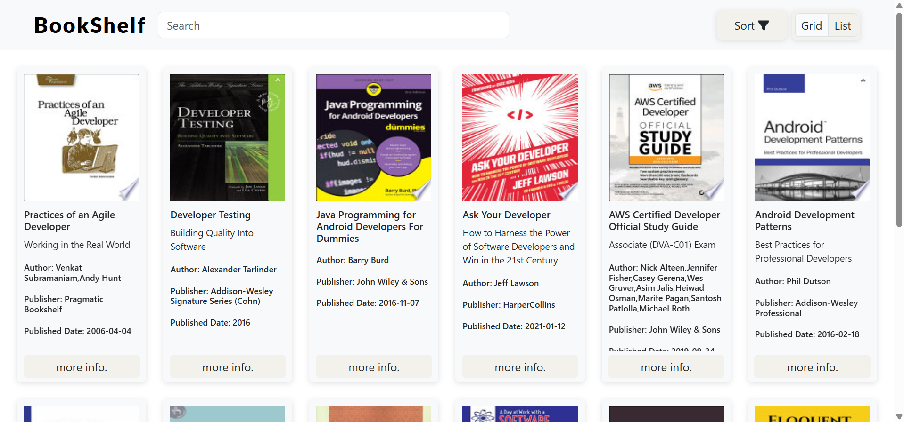
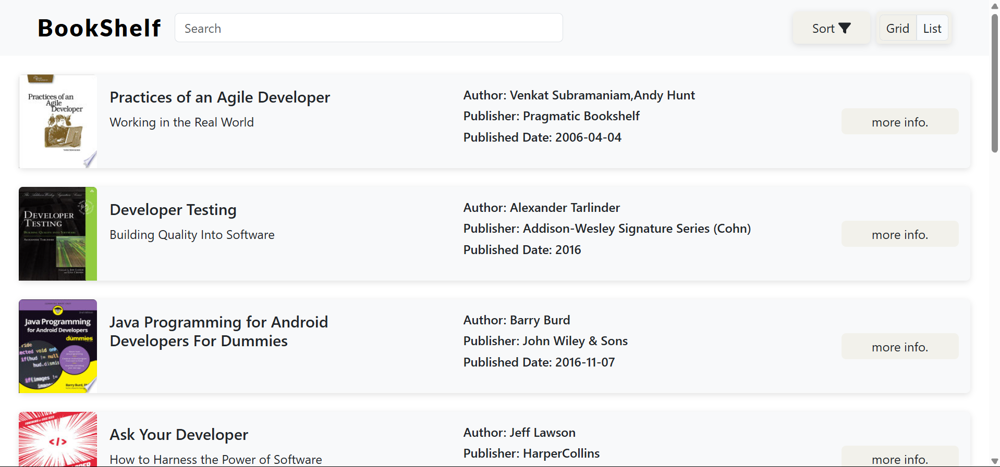

# BookShelf – Your Digital Library, Anytime, Anywhere!

## About BookShelf

BookShelf is simple digital library where it fetches data from the API and present it in a intractive way.

## Features

- Display book listing dynamically in both grid and list format.
- Display key book information like title,author,publication date.
- Loads books in pages for smooth navigation.
- Allow user to perform search on title or author.
- Sort books alphabetically or by publication date.
- Allow user to get more info. of perticular book by one click.

## Screenshots




## 🔧 Installation & Usage

```sh
cd BookShelf
npm install //install dependencies
npm start   //start the server
```

## Live Demo

Check out the live version here: [Deployment Link](https://book-shelf-6cnm.onrender.com)

