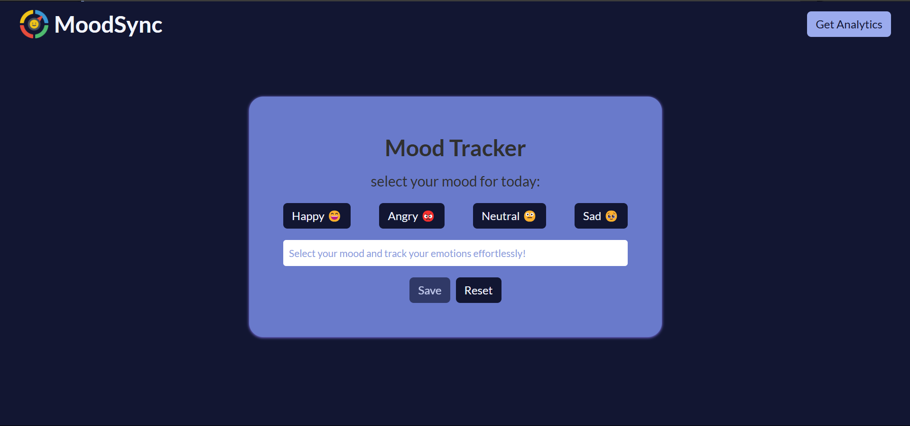
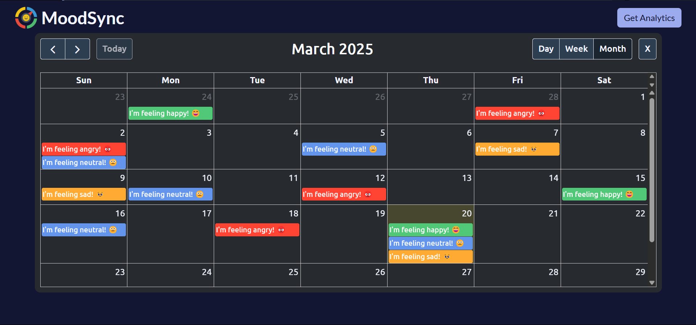

# 🌈 MoodSync – Track Your Emotions Effortlessly

## 🚀 About MoodSync

MoodSync is a simple yet powerful emotion-tracking application that allows users to log their daily emotions and visualize their mood patterns over time. The built-in calendar feature provides analytics for better self-awareness.

## 🌟 Features

- ✅ Log your emotions daily with a simple click.
- 📅 View your mood trends on a calendar.
- 📊 Analyze emotional patterns over weeks, months time frames.
- 🎨 Intuitive and user-friendly UI.

## 🖼️ Screenshots

## 🔧 Installation & Usage

1. Open `index.html` in a browser.
2. Start tracking your daily emotions!

## 🚀 Live Demo

Check out the live version here: [Deployment Link](https://moodsynk.netlify.app/)

## 🤝 Contributing

Contributions are welcome! Feel free to fork the repo, make changes, and submit a pull request.

Track your emotions with **MoodSync** and stay mindful every day! ✨

---

Let me know if you want any modifications! 😊
