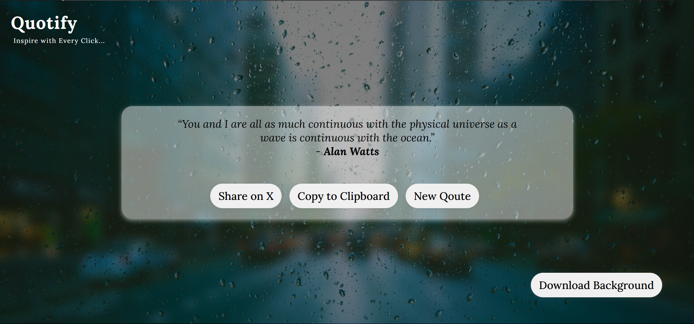

# Qoutify 📜✨

## 🚀 About Qoutify

Qoutify is a simple javasript DOM based application that generates random motivational and inspirational quotes with a single click. Users can easily copy quotes, share them on Twitter, and even download a background image with the quote.

## 🌟 Features

- 🎲 Generate random quotes with a single click.
- 📋 Copy quotes to clipboard.
- 🐦 Share quotes directly on Twitter.
- 🖼️ Download quotes as an image.
- 💡 Minimalist and user-friendly UI

## 🔗 API Endpoint

Qoutify fetches random quotes using the following API:
Endpoint: https://api.freeapi.app/api/v1/public/quotes/quote/random

📖 API Documentation: [Click here](https://freeapi.hashnode.space/api-guide/apireference/getARandomQuote)

## 🖼️ Screenshots

## 🔧 Installation & Usage  
1. Open `index.html` in a browser  
2. Click on "Generate Quote" to see a new quote 

## 🚀 Live Demo
Check out the live version here: [Deployment Link](url)

## 🤝 Contributing

Contributions are welcome! Feel free to fork the repo, make changes, and submit a pull request.

Stay inspired with Qoutify! ✨
