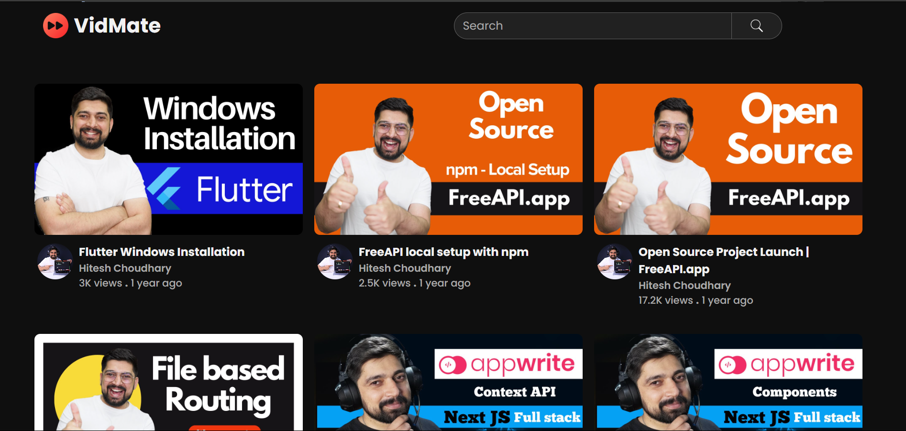
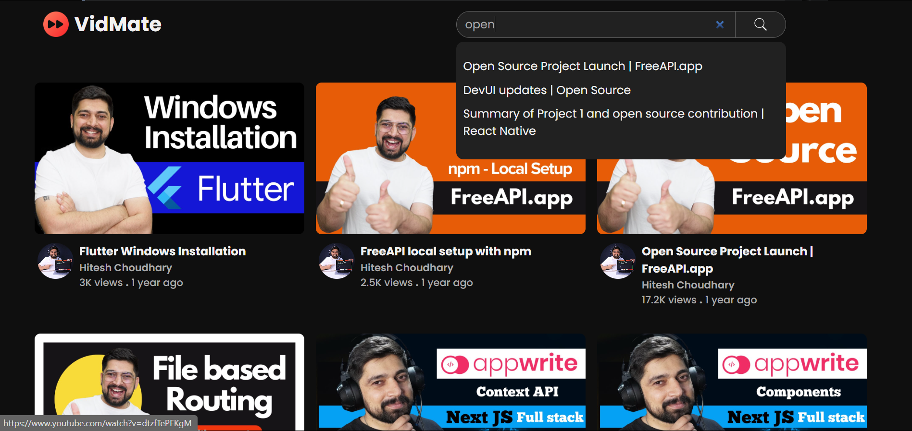
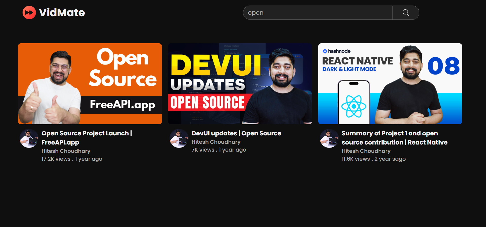

# VidMate 🎥✨

## 🚀 About VidMate

VidMate is a frontend-based video browsing application that allows users to fetch and explore YouTube videos seamlessly. It implements infinite scrolling, local search, and caching for a smooth experience.

## 🌟 Features

- 🔍 **Search Videos Locally** - Search for videos without additional API calls.
- 🔄 **Infinite Scrolling** - Load more videos as you scroll down.
- 📥 **Local Caching** - Stores videos locally to optimize performance.
- 🎯 **Throttling & Debouncing** - Optimized event handling for efficient performance.
- 📊 **Formatted Views & Timestamps** - Displays views and upload times in a readable format.
- 🖼️ **User-Friendly Interface** - Clean and intuitive UI for easy navigation.

## 🔗 API Endpoint

VidMate fetches videos using the following API:
Endpoint: `https://api.freeapi.app/api/v1/public/youtube/videos`

📖 API Documentation: [Click here](https://freeapi.hashnode.space/api-guide/apireference/getYoutubeVideos)

## 🖼️ Screenshots

## 🔧 Installation & Usage  
1. Open `index.html` in a browser  
2. Start browsing and searching videos  

## 🚀 Live Demo
Check out the live version here: [Deployment Link](https://vid-mate.netlify.app/)

## 🤝 Contributing

Contributions are welcome! Feel free to fork the repo, make changes, and submit a pull request.

### Enjoy browsing with VidMate! 🎬✨

